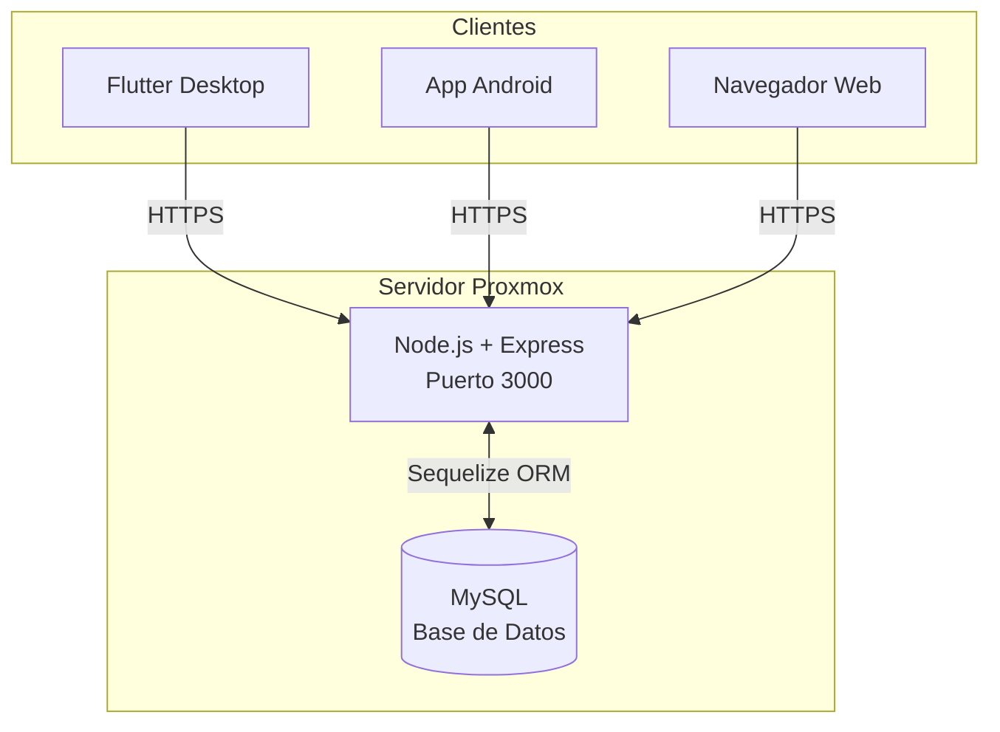
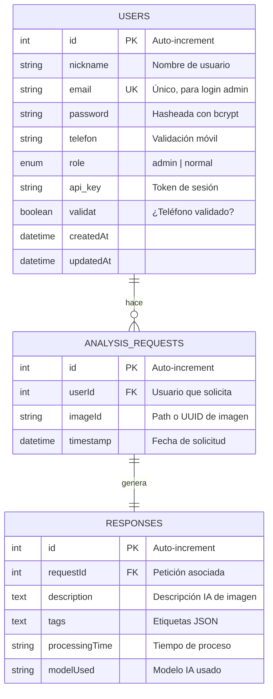
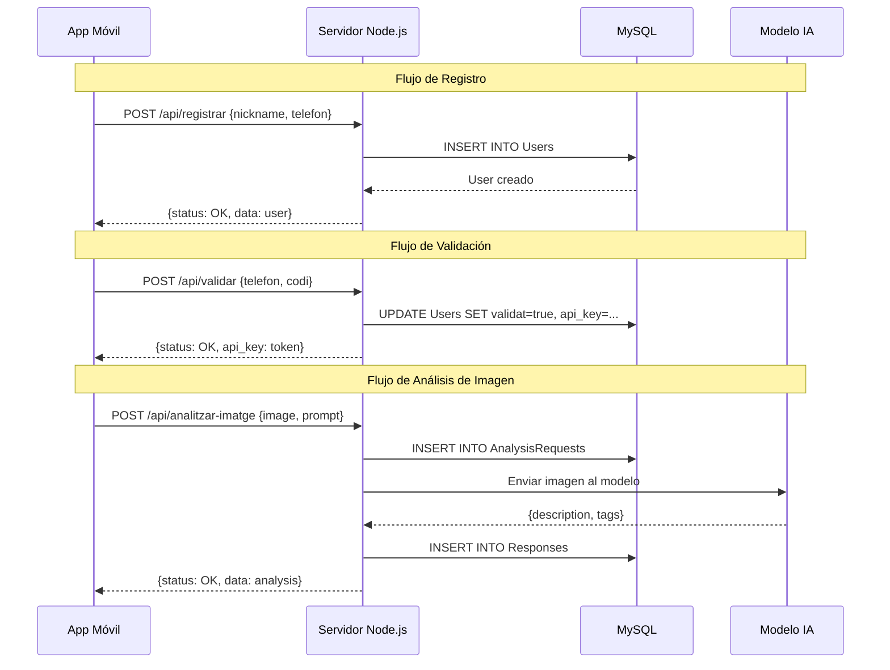

# 📚 Documentación del Servidor UXIA

Este documento describe la arquitectura, base de datos y API del servidor UXIA.

---

## 🏗️ Arquitectura General



**URL Pública:** `https://uxia6.ieti.site`

---

## 🗄️ Diagrama de Base de Datos



---

## 📋 Descripción de Tablas

### Tabla `Users`
Almacena usuarios del sistema (tanto administradores como usuarios móviles).

| Campo | Tipo | Descripción |
|:---|:---|:---|
| `id` | INTEGER | Identificador único, auto-incremental |
| `nickname` | STRING | Nombre visible del usuario |
| `email` | STRING | Correo electrónico (único), usado para login de admin |
| `password` | STRING | Contraseña hasheada |
| `telefon` | STRING | Número de teléfono para validación |
| `role` | ENUM | `admin` (acceso total) o `normal` (usuario móvil) |
| `api_key` | STRING | Token de sesión activo |
| `validat` | BOOLEAN | `true` si el usuario ha validado su teléfono |

### Tabla `AnalysisRequests`
Registra las solicitudes de análisis de imagen enviadas por usuarios.

| Campo | Tipo | Descripción |
|:---|:---|:---|
| `id` | INTEGER | Identificador único |
| `userId` | INTEGER | FK → Users.id (quién solicitó) |
| `imageId` | STRING | Ruta o UUID de la imagen analizada |
| `timestamp` | DATETIME | Momento de la solicitud |

### Tabla `Responses`
Almacena las respuestas del modelo de IA para cada análisis.

| Campo | Tipo | Descripción |
|:---|:---|:---|
| `id` | INTEGER | Identificador único |
| `requestId` | INTEGER | FK → AnalysisRequests.id |
| `description` | TEXT | Descripción generada por la IA |
| `tags` | TEXT | Etiquetas en formato JSON |
| `processingTime` | STRING | Tiempo que tardó el análisis |
| `modelUsed` | STRING | Modelo de IA utilizado |

---

## 🔌 API Endpoints

### Base URL
```
https://uxia6.ieti.site
```

---

### 🔐 Autenticación Admin

#### `POST /api/admin/usuaris/login`
Login para administradores (panel de gestión).

**Request:**
```json
{
  "email": "admin@example.com",
  "password": "password"
}
```

**Response (200 OK):**
```json
{
  "status": "OK",
  "message": "Usuari autenticat correctament",
  "data": {
    "token": "ADMIN1234567890TOKEN"
  }
}
```

**Response (401 Error):**
```json
{
  "status": "ERROR",
  "message": "Credencials incorrectes"
}
```

---

### 👥 Gestión de Usuarios

#### `GET /api/admin/usuaris`
Lista todos los usuarios registrados. **Requiere autenticación**.

**Headers:**
```
Authorization: Bearer <token>
```

**Response (200 OK):**
```json
{
  "status": "OK",
  "message": "Usuaris obtinguts correctament",
  "data": [
    {
      "id": 1,
      "nickname": "admin",
      "email": "admin@example.com",
      "telefon": "123456789",
      "role": "admin",
      "validat": false
    }
  ]
}
```

---

### 📱 Registro y Validación (App Móvil)

#### `POST /api/registrar`
Registra un nuevo usuario desde la app móvil.

**Request:**
```json
{
  "nickname": "usuario1",
  "telefon": "600123456"
}
```

**Response (200 OK):**
```json
{
  "status": "OK",
  "message": "Usuari registrat correctament",
  "data": {
    "id": 2,
    "nickname": "usuario1",
    "telefon": "600123456",
    "validat": false
  }
}
```

---

#### `POST /api/validar`
Valida el teléfono del usuario (simulado).

**Request:**
```json
{
  "telefon": "600123456",
  "codi": "1234"
}
```

**Response (200 OK):**
```json
{
  "status": "OK",
  "message": "Usuari validat correctament",
  "data": {
    "id": 2,
    "validat": true,
    "api_key": "TOKEN123456789"
  }
}
```

---

#### `GET /api/perfil`
Obtiene el perfil del usuario autenticado.

**Headers:**
```
Authorization: Bearer <api_key>
```

**Response (200 OK):**
```json
{
  "status": "OK",
  "message": "Perfil obtingut correctament",
  "data": {
    "id": 2,
    "nickname": "usuario1",
    "telefon": "600123456",
    "validat": true
  }
}
```

---

### 🖼️ Análisis de Imágenes (IA)

#### `POST /api/analitzar-imatge`
Envía una imagen para ser analizada por el modelo de IA.

**Headers:**
```
Authorization: Bearer <api_key>
```

**Request:**
```json
{
  "image": "base64_encoded_image_data",
  "prompt": "Descriu aquesta imatge",
  "model": "qwen2.5vl:7b"
}
```

**Response (200 OK):**
```json
{
  "status": "OK",
  "message": "Imatge analitzada correctament",
  "data": {
    "description": "La imagen muestra un paisaje montañoso...",
    "tags": ["montaña", "naturaleza", "paisaje"],
    "processing_time": "2.3s",
    "model_used": "qwen2.5vl:7b"
  }
}
```

---

## 🔄 Flujo de Datos



---

## 📁 Estructura del Proyecto

```
serverUxia/
├── src/
│   ├── server.js           # Punto de entrada principal
│   ├── config/
│   │   └── database.js     # Conexión a MySQL con Sequelize
│   ├── routes/
│   │   └── api.js          # Definición de endpoints
│   ├── middleware/
│   │   └── auth.js         # Verificación de tokens
│   ├── models/
│   │   ├── index.js        # Exporta todos los modelos
│   │   ├── User.js         # Modelo de usuario
│   │   ├── AnalysisRequest.js
│   │   └── Response.js
│   └── utils/
│       └── response.js     # Helper para respuestas JSON
├── .env                    # Variables de entorno
├── package.json
└── test_api.js             # Script de pruebas
```

---

## ⚙️ Variables de Entorno (.env)

```env
PORT=3000
DB_HOST=localhost
DB_USER=uxia_user
DB_PASS=uxia_password_2026
DB_NAME=uxia
```

---

## 🔒 Seguridad

- **Contraseñas**: Se recomienda hashear con bcrypt (actualmente en desarrollo)
- **Tokens**: Generados aleatoriamente al login/validación
- **CORS**: Habilitado para permitir peticiones desde cualquier origen
- **HTTPS**: Gestionado por el proxy inverso del Proxmox

---

*Documentación generada: Febrero 2026*
